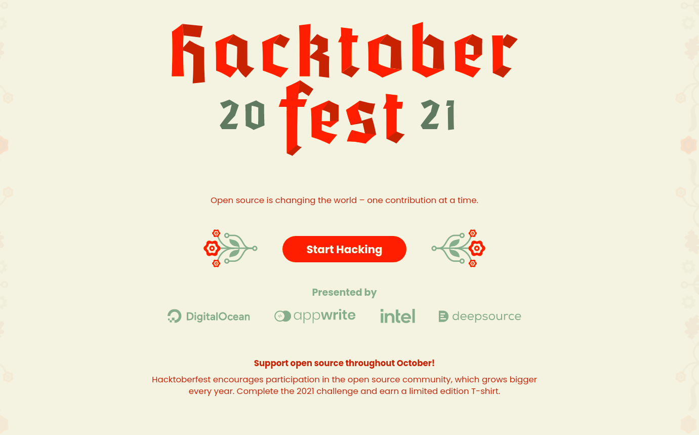
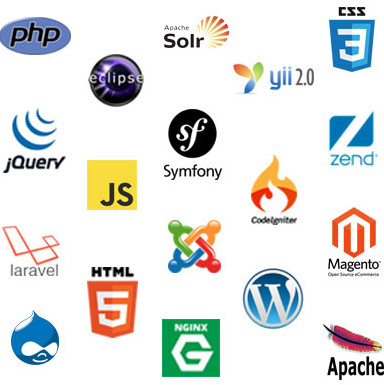

## The Hitchhiker's Guide to the Hacktoberfest

Hacktoberfest, in its 8th year, is a month-long celebration of open source software run by DigitalOcean. 

During the month of October, they invite you to join open-source software enthusiasts, beginners, and the developer community by contributing to open-source projects. 

You can do this in a variety of ways:

1. Prepare and share your project for collaboration
2. Contribute to the betterment of a project via pull requests
3. Organize an event
4. Mentor others
5. Donate directly to open source projects

#### So what is open source?

Open source software is code that is designed to be publicly accessible—anyone can see, modify, and distribute the code as they see fit.

Various applications and services that you use such as Telegram, Signal, Python, Git, Supabase are all opensourse applications.

So What are you waiting for??

head over to [tasks](./tasks.md) right now and start contributing