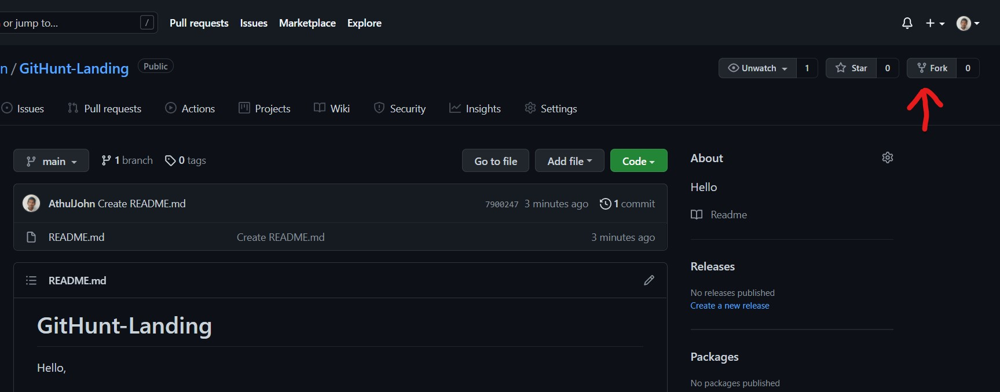
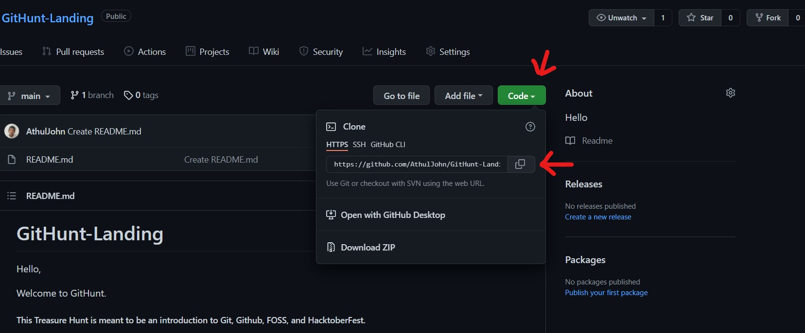
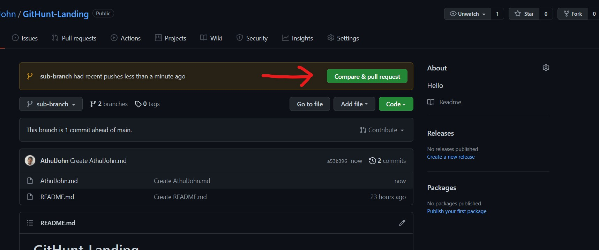
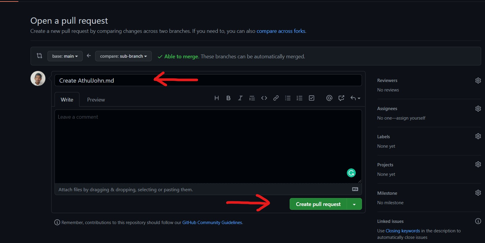

# Tasks

Welcome to your first task. Let's just refresh what we have learned about git.

* First of all, fork this repository using the fork button in the top right corner.


* Then you should be redirected to your version of this repository. You can check whether you have succeeded by looking at the repository name. Its name should be in the format < Your Name >/GitHunt-Landing.

* Next clone the repository by clicking the green "Code" Button and click the link copy button, as given in the below picture.


* Now open your terminal or command prompt from the desired location for the repository and type the following command to clone the repository.<br>
``` git clone <The link you copied> ```

* Now you should find a folder named GitHunt-Landing in the location you selected. Inside the folder, you should be able to find the readme and tasks file.

* Now create a new text file and add your name, and an introduction about yourself inside the file. After editing, save the file as < Your Name >.md ( Eg: KiranSBaliga.md ).

* After saving the file, go to the terminal and type the following commands to commit the change you made.<br>
```git add .```<br>
```git commit -m "First Commit"```

* Now push the commit you just made using the following command.<br>
```git push```<br>
( If you have not logged into your account, you may have to enter your login credentials when asked)

* Now you can notice that the changes you just made have been updated in your Github account. But it is updated in just your repository. To make this change a part of the original repository, you have to give a pull request. You can do this by clicking the green "Compare & Pull Request Button".  <br>
Now you should be in the "Open a Pull Request" Page. Enter your message and click "Create Pull Request" button. 

